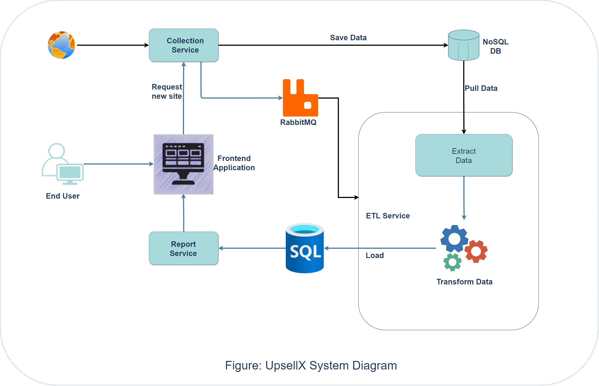

UpsellX Collector
================
> A digital advertising consultant.
## Goals
- Gathering data from disparate sources.
- Integrating data into a unified view for data consumers.
- Preparing data for analytics and reporting.
- Managing data pipelines for a continuous flow of data from source to destination systems.
- Managing the complete infrastructure for the collection, processing, and storage of data.
## Application Work Flow
- End use will submit a website link which contain other social & public links associated with this site.
- Service collector receive the link and parse public & social links and information from this link. It will start some own crawler service and save into data repository of unstructured, semi-structured and structured data.
- Then publish an event to ETL system through RabbitMQ.
- ETL service consume it & process data by querying, manipulating, cleaning, enriching, standardizing, and validating data.
  
    - Load data to the Enterprise Data Environment, in which raw data is staged and so it can be organized, cleaned, and optimized for use by end-users.
- End-users, such as business stakeholders, analysts, and programmers who consume data for various purposes.
## Considerations
- Cloud Outage

    - Didn't have any personal cloud account.
- Short Time

    - extracting only Facebook & Twitter data due to prototype purpose.
- Blocking of IP

    - IP can be banned for public data for Continuous data crawling.
  
## System Diagram:


## Technology
- ### Server/Backend
  - JavaScript
  - Expressjs
  - Node.js
  - MongoDB
  - MariaDB
  - RabbitMQ

- ### Web/Frontend
  - JavaScript
  - Angular
  
## Docker - run!
* Cloning the repo

```bash
$ git clone https://github.com/ferozahmed26/upsellx-collector
```
* Building an image

```bash
$ docker-compose build
```

* Running containers

```bash
$ docker-compose up
```

* Stopping containers

```bash
$ docker-compose down
```

